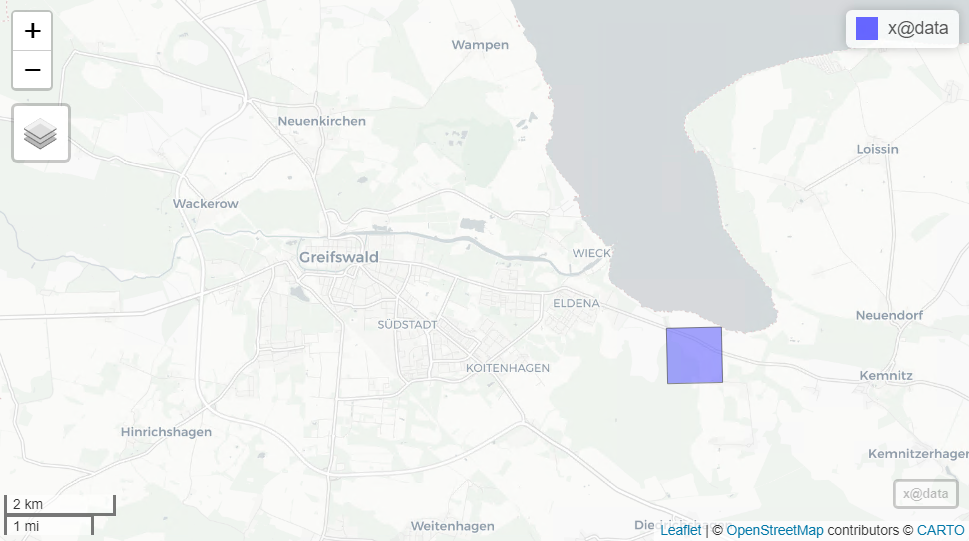

Tutorial for creating Digital Surface Model (DSM) from Airborne Laser Scanning (ALS) data using lidR package in R.
<br/>
<br/>

# 1. Setup working environment
This tutorial uses [R](https://www.r-project.org/) programming language and [Rstudio](https://posit.co/products/open-source/rstudio/) application as an integrated development environment for R to process LiDAR point cloud.

R and Rstudio are available for you in [AppHub system](https://apphub.wolke.uni-greifswald.de/apphub/rstudio). In case you wish to setup R and Rstudio on your local machine, or you are not familiar with the Rstudio interface, refer to [this document](https://github.com/VietDucNg/DSM_from_pointCloud/blob/main/materials/Introduction_R_Rstudio.pdf). 

Open Rstudio and create new R script by going to *File/New File/R Script*.

Install necessary pakages for the tutorial

```{r eval=FALSE}
# Airborne LiDAR Data Manipulation and Visualization for Forestry Applications
install.packages("lidR")
# Interactive viewing of spatial data
install.packages("mapview")
# Raster data analysis
install.packages("terra")
```

Load the packages
```{r message=FALSE, warning=FALSE}
library(lidR)
library(mapview)
library(terra)
```

Preapare parallel computation in lidR
```{r}
# get how many CPU threads lidR using
get_lidr_threads()
# set how many threads lidR should use
set_lidr_threads(40) # recommended to use maximum 80% of total threads
# check how many CPU threads lidR using again
get_lidr_threads()
```
<br/>

# 2. ALS data
## 2.1. Load data
Load ALS data (3dm_33_400_5993_1.copc.laz) into Rstudio.
```{r}
las = readLAS("data/3dm_33_400_5993_1.copc.laz")
```
## 2.2. Define CRS
The CRS is not part of the metadata, so you have to specify it
```{r}
# get CRS
las@crs
# assign CRS to the data
lidR::projection(las) = 25833
# check new CRS of the data
las@crs
```

## 2.3. View data

View data in 3D. Use left, middle and right mouse for easily navigation in 3D environment. You can specify point size and view the point with color based on different attribute. 

> ⚠️ NOTE:
> Viewing 3D point cloud is a heavy processing, large data may crash your Rstudio. Be careful if you are using local machine with point cloud more than 1 GB (see in *Environment* panel).

```{r eval=FALSE}
# view point cloud by Classification attribute
plot(las, size=2, color='Classification')
```


```{r eval=FALSE}
# view point cloud by Z attribute
plot(las, size=2, color='Z')
```


For better orientation, you might want to add a background layer. Then we can see where is the bounding box of ALS data located.

```{r eval=FALSE}
# view point cloud by Z attribute
plot(las, mapview = TRUE)
```



> ℹ️ Information:
> 3D visualization in R is limited. QGIS or CloudCompare are free software with more capabilities which are worth to check out. 

## 2.4. Explore data

See point cloud attribute table by the following code. You can also click on *las* variable in *Environment* panel. 
```{r}
# see data attribute table
las@data
```

See overall information of the point cloud
```{r}
summary(las)
```

# 3. Point density
Depending on the used sensor, flight height, land cover and other factors the point density, i.e., the number of returns per square meter can differ. 

We can map and assess point density of the point cloud by the code below. It basically creates a raster with a specific cell size and counts the number of returns in this cell. Use a cell size of 1 m (hence we will receive the number of points per square meter).

```{r}
# create point density raster
density = grid_density(las, res = 1) # density in 1 square meter
plot(density, main = 'original point density')
density
```

Now look at the result, is the point density equally distributed?

Let's create a second density raster, also using 1 meter resolution. But this time we only use points are first returns and not classified as 22 and 23. Points classifed as 22 and 23 are those points from flight line overlaps.

```{r}
# filter points and save to new data
filtered_las = filter_poi(las, ReturnNumber==1 & !(Classification %in% c(22,23)))
# check unique ReturnNumber value in new data after filtering
unique(filtered_las@data$ReturnNumber)
# check unique Classification value in new data after filtering
unique(filtered_las@data$Classification)

# create point density raster for the filtered data
filtered_density = grid_density(filtered_las, res = 1) # density in 1 square meter
plot(filtered_density, main = 'filtered point density')
filtered_density

```

Let's compare 2 density rasters

```{r}
par(mfrow = c(1,2)) # create a 1 row x 2 column plotting matrix
plot(density, main = 'original')
plot(filtered_density, main = 'filtered')
```

# 4. Digital Terrain Model (DTM)

DTM is a raster representing the altitude of the terrain. To create a DTM, we ignore features above ground level and use only ground returns or points. 

Ground classification is a separate processing step in working with point cloud data, but conveniently, for the point cloud we use this was already done. The points were classified as ground have 2 value in Classification attribute.

The *rasterize_terrain* function used to generate DTM with the point cloud as input, it automatic use points with classification value of 2 only. Various algorithms are available, e.g. Triangular Irregular Network (TIN), Invert Distance Weighting (IDW), Kriging, etc.

In this tutorial, let's create a DTM of 1 meter resolution with IDW method which is simple, and highly available. The IDW method in lidR package come with spatial interpolation which fill the gap where there is no point in a 1x1m raster cell, using k-nearest neighbour (KNN) approach with an inverse-distance weighting. The method based on assumption that the raster cell value where there is no point can be estimated as a weighted average values from *k* nearest points. *P* defines power of inverse-distance weighting, and *rmax* defines maximum radius to search for nearest points. You can play with the parameter to see the difference in results.

```{r}
# create DTM using IDW method
dtm = rasterize_terrain(las, res=1,
                        algorithm = knnidw(k = 10, p = 2, rmax = 50))
plot(dtm, main='DTM')
dtm
```

```{r eval=FALSE}
# take a look at the DTM in 3D
plot_dtm3d(dtm)
```


## Shaded DTM

We can visualize the DTM as a hillshade as follow.

```{r}
# compute terrain characteristics from DTM
dtm_prod = terrain(dtm, v = c("slope", "aspect"), unit = "radians")
plot(dtm_prod)

# compute hill shade from slope and aspect layer
dtm_hillshade = shade(slope = dtm_prod$slope, aspect = dtm_prod$aspect)
plot(dtm_hillshade, col =gray(0:30/30), main ='Shaded DTM')
```

# 5. Digital Surface Model (DSM)

DSM is a raster representing the altitude of the feature surfaces including the ground. So this time we use the entire point cloud to generate DSM, not only ground points. 

Different methods are available in lidR for creating a DSM, e.g. Point-to-raster, TIN, Pit-free, etc.

In this tutorial, let's create a DSM of 1 meter resolution with Point-to-raster method which is extremely fast and widely used. The method create a grid with a user-defined pixel size and overlay to the point cloud, then the height value of the highest point assigned to each cell value. 

First, we can exclude noisy points that have an elevation value higher than 80m (those could be caused by e.g. small clouds or birds).

```{r}
# filter points
filtered_dsm_las = filter_poi(las, Z < 80)
# check max Z values of filtered las
max(filtered_dsm_las@data$Z)

# create a DSM using point-to-raster method
dsm = rasterize_canopy(filtered_dsm_las, res = 1, algorithm = p2r())
plot(dsm)
dsm
```

There may be some empty pixels in the output DSM. It is due to the low point density of the point cloud or/and the high resolution of the defined grid, which leads to some grid cells may not contain any points.

```{r}
# How many empty pixel are there?
sum(is.na(values(dsm))) 

```

One option to fill the gap in the surface model is using TIN interpolation.

```{r}
# create a DSM using point-to-raster + TIN interpolation
dsm = rasterize_canopy(filtered_dsm_las, res = 1, 
                       algorithm = p2r(na.fill = tin()))
plot(dsm, main='DSM')
dsm

# Check again how many empty pixel are there?
sum(is.na(values(dsm))) 
```

# 6. Normalized Digital Surface Model (nDSM)

Often also referred to as Canopy Height Model (CHM) in forestry, which shows the relative height above ground of features. The CHM can be generated by subtracting the terrain surface (DTM) from the feature surface (DSM).

```{r}
# create CHM from DSM and DTM
chm = dsm - dtm
plot(chm, main='CHM')
chm

# compare DTM, DSM and CHM
par(mfrow = c(1,3)) # create a 1 row x 3 column plotting matrix
plot(dtm, main='DTM')
plot(dsm, main='DSM')
plot(chm, main='CHM')

```


